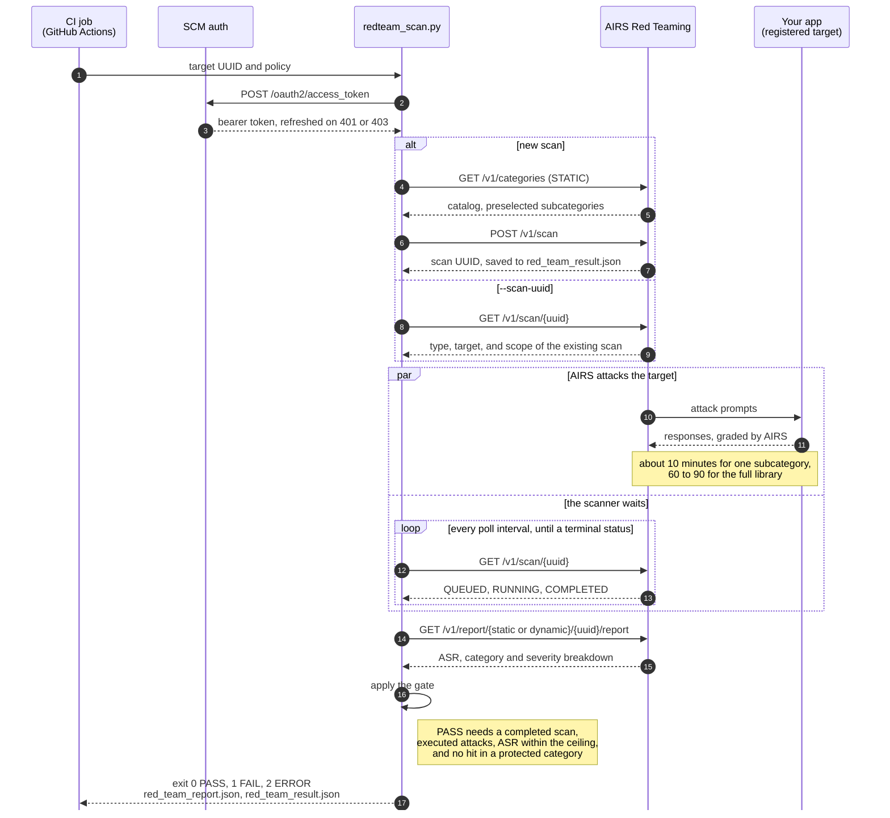

# Prisma AIRS Red Teaming CI/CD Pipeline

Runs a Prisma AIRS AI Red Teaming scan against a target registered in Strata Cloud Manager and turns the result into a CI pass or fail. Supports Attack Library (STATIC) and Agent (DYNAMIC) scans.

The scanner tests an application that is already deployed. It does not deploy anything.

## How it works



## How the gate decides

| Exit | Verdict | When |
| --- | --- | --- |
| 0 | PASS | The scan completed, attacks actually ran, ASR is at or below the ceiling, and no protected category had a successful attack |
| 1 | FAIL | ASR is above the ceiling, or a protected category had a successful attack |
| 2 | ERROR | Anything else: bad configuration, API error, timeout, partial scan, or a report that shows no executed attacks |

ASR is a percentage, so `1.09` means 1.09%. A scan that completes with zero executed attacks is an error, not a pass. Protected categories (`--fail-on-categories`) work with STATIC scans only, and each one has to be in the scan's scope and show executed attacks in the report.

A pass means the target held up against the attacks that ran. It does not prove the application is secure.

## Use it in your repository

Copy an example into `.github/workflows/`:

- [example-nightly-workflow.yml](examples/example-nightly-workflow.yml) runs the full attack library every night and can post to Slack when it fails.
- [example-pr-workflow.yml](examples/example-pr-workflow.yml) is a reusable workflow you call after a deployment job. It scans PROMPT_INJECTION and JAILBREAK only, so it finishes in PR time.

Both check out this scanner at a pinned release (`v0.2.0`) into `.airs-scanner`. Nothing needs to be copied into your repository besides the workflow file. To use a fork, change `repository` and `ref` in the checkout step.

Add these in your repository settings:

| Name | Kind | Value |
| --- | --- | --- |
| `PRISMA_AIRS_CLIENT_ID` | Variable | Service account client ID |
| `PRISMA_AIRS_TSG_ID` | Variable | Tenant service group ID |
| `PRISMA_AIRS_CLIENT_SECRET` | Secret | Service account secret |
| `PROD_TARGET_UUID` | Variable | Target for the nightly example |
| `SLACK_WEBHOOK_URL` | Secret | Optional, nightly failure alerts |

Calling the PR example from a deployment workflow:

```yaml
red_team:
  needs: deploy
  uses: ./.github/workflows/example-pr-workflow.yml
  with:
    target_uuid: ${{ needs.deploy.outputs.airs_target_uuid }}
    expected_sha: ${{ needs.deploy.outputs.requested_sha }}
    deployed_sha: ${{ needs.deploy.outputs.verified_running_sha }}
  secrets:
    PRISMA_AIRS_CLIENT_SECRET: ${{ secrets.PRISMA_AIRS_CLIENT_SECRET }}
```

The deploy job has to read the running revision back from the application and output it as `verified_running_sha`. Copying the requested SHA into that output defeats the check. Give each PR its own target, or run deploy and scan under one concurrency group. Name that group something other than `red-team-target-<uuid>`, which the scan job already holds, or GitHub cancels the run as a deadlock.

Self-hosted runners need Actions Runner 2.327.1 or later for the pinned Node 24 actions.

## Run it from this repository

Go to Actions > Prisma AIRS Red Teaming Scan > Run workflow and enter a target UUID. Leave categories empty for the full library, or name a few for a faster scan. Fill in `scan_uuid` to evaluate a scan that already exists instead of starting a new one. To run it on a schedule, uncomment the `schedule` block and set the `RED_TEAM_TARGET_UUID` variable.

## Run it locally

```bash
python3 -m venv .venv && . .venv/bin/activate
pip install -r requirements.txt
export PRISMA_AIRS_CLIENT_ID=... PRISMA_AIRS_CLIENT_SECRET=... PRISMA_AIRS_TSG_ID=...

python redteam_scan.py --list-targets
python redteam_scan.py --list-categories
python redteam_scan.py --target-uuid <uuid> --categories PROMPT_INJECTION --fail-on-categories PROMPT_INJECTION
```

Tested on Python 3.12.

## Scan scope

With no `--categories`, a STATIC scan runs the subcategories SCM preselects in its UI. Naming a group (`SECURITY`, `SAFETY`, `BRAND`, `COMPLIANCE`) runs that group's preselected subcategories. Name a subcategory to add one that is not preselected, such as `TOOL_LEAK` (target needs tool calling) or `INDIRECT_PROMPT_INJECTION` (target needs internet access). `MULTI_TURN` is inactive in the catalog right now and is rejected. `--list-categories` shows which subcategories are inactive or not preselected.

DYNAMIC scans run 6 streams per goal at depth 10 unless you set `--stream-breadth` and `--stream-depth`. They have no category breakdown, so `--categories` and `--fail-on-categories` are rejected for DYNAMIC.

## How long scans take

Measured on 2026-10-06 against a Bedrock Nova Lite application with the AIRS runtime in front of it:

| Scan | Size | Time |
| --- | --- | --- |
| STATIC, PROMPT_INJECTION only | 226 attack units | about 10 minutes |
| STATIC, full preselected library | 1,568 attack units (4,434 attacks) | 60 to 90 minutes |
| DYNAMIC, default size | 60 streams | DYNAMIC_TIME |

Time depends on how fast the target answers and on any rate limit set on the target. Scans that run against the same target at the same time slow each other down: the full library took 89 minutes while two other scans shared the target, and was on pace for about 60 alone. The manual workflow waits up to 240 minutes by default (300 at most) inside a 330-minute job. GitHub-hosted jobs stop at 360 minutes.

## Options

| Option | Default | Notes |
| --- | --- | --- |
| `--target-uuid` | | Required for a new scan |
| `--scan-uuid` | | Evaluate an existing scan. Type, target, and scope come from that scan |
| `--scan-type` | `STATIC` | `STATIC` or `DYNAMIC` |
| `--scan-name` | generated | 3 to 255 characters |
| `--categories` | preselected | STATIC only |
| `--stream-breadth`, `--stream-depth` | 6, 10 | DYNAMIC only |
| `--max-asr-percent` | 5 | 0 to 100. Equal to the ceiling passes |
| `--fail-on-categories` | none | STATIC only |
| `--poll-interval` | 30 seconds | |
| `--max-wait-minutes` | 60 | |
| `--report-out` | `red_team_report.json` | |
| `--result-out` | `red_team_result.json` | |
| `--expected-sha`, `--deployed-sha` | | Full SHAs, given together, must match |

`MAX_ASR_PERCENT`, `FAIL_ON_CATEGORIES`, `SCAN_CATEGORIES`, `POLL_INTERVAL_SECONDS`, and `MAX_WAIT_MINUTES` set defaults from the environment; flags win. `PRISMA_AIRS_TOKEN_ENDPOINT`, `PRISMA_AIRS_RED_TEAM_DATA_ENDPOINT`, and `PRISMA_AIRS_RED_TEAM_MGMT_ENDPOINT` override the API endpoints. `TSG_ID` works in place of `PRISMA_AIRS_TSG_ID`.

## Output

`red_team_result.json` is written when the run starts and again as soon as the scan is created, so the scan UUID survives a crash or timeout. It records the scanner version, target, scan, policy, final status, verdict, exit code, ASR, and any error. `red_team_report.json` holds the raw AIRS report, or a short job summary if the scan did not complete. The job summary leaves out the target configuration, which contains the target's system prompt.

`ci_report.py summary` writes the GitHub job summary. `ci_report.py enforce` exits 0 only for a PASS result from the current workflow run.

Reports describe weaknesses in your application, so treat artifacts accordingly. The workflows keep them for 14 days.

## When a run times out or fails

Cancelling or timing out the CI job does not stop the scan in AIRS, and rerunning the workflow starts a new scan that costs target tokens again. Evaluate the one that is already running instead:

```bash
python redteam_scan.py --scan-uuid <scan_uuid from red_team_result.json> --fail-on-categories PROMPT_INJECTION
```

The scanner refreshes its token once when a request gets a 401 or 403, and retries reads up to three times on connection errors, timeouts, 429, and 5xx. It never retries scan creation. If creation times out or returns a 5xx, the scan may exist anyway, so check SCM before starting another.

Errors you may see:

- `HTTP 400: Target does not support multi-turn...` means the scan asked for `MULTI_TURN`, or the target needs to be revalidated in SCM.
- `HTTP 403 {"msg":"Access denied"}` from the Red Teaming API usually means a wrong path or HTTP method, not a permissions problem. Check any endpoint overrides first.
- `HTTP 401: invalid_client` means a wrong client ID or secret.
- An ASR near zero on a target you expected to be weak can mean the target is broken. A target that returns HTTP 200 with an error in the body, such as a retired model, makes every attack look refused. Send it a test prompt before trusting the result.

## Development

```bash
pip install -r requirements-dev.txt
python -m pytest -q
```

The Tests workflow runs the suite and actionlint on every push to `main` and every PR. The tests use a local HTTP server and real report fixtures and need no credentials. [docs/EVIDENCE.md](docs/EVIDENCE.md) records the live validation runs.

[model-security-pipeline-integration](https://github.com/scthornton/model-security-pipeline-integration) covers model artifact scanning. MIT license. See [SECURITY.md](SECURITY.md) to report a vulnerability.
